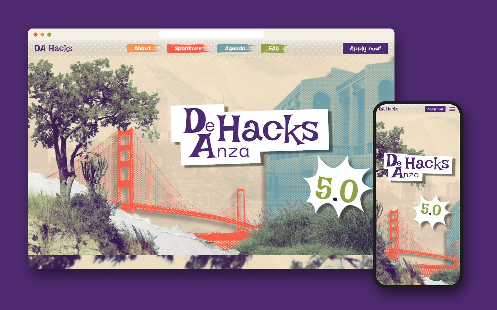
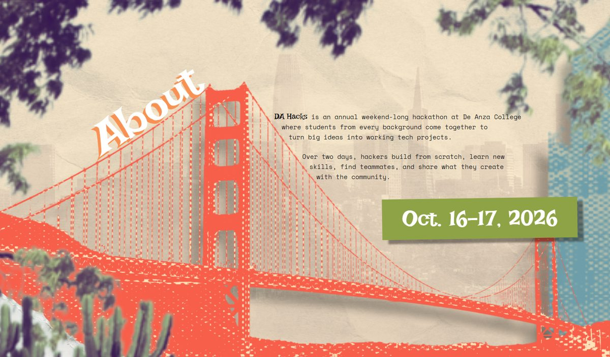
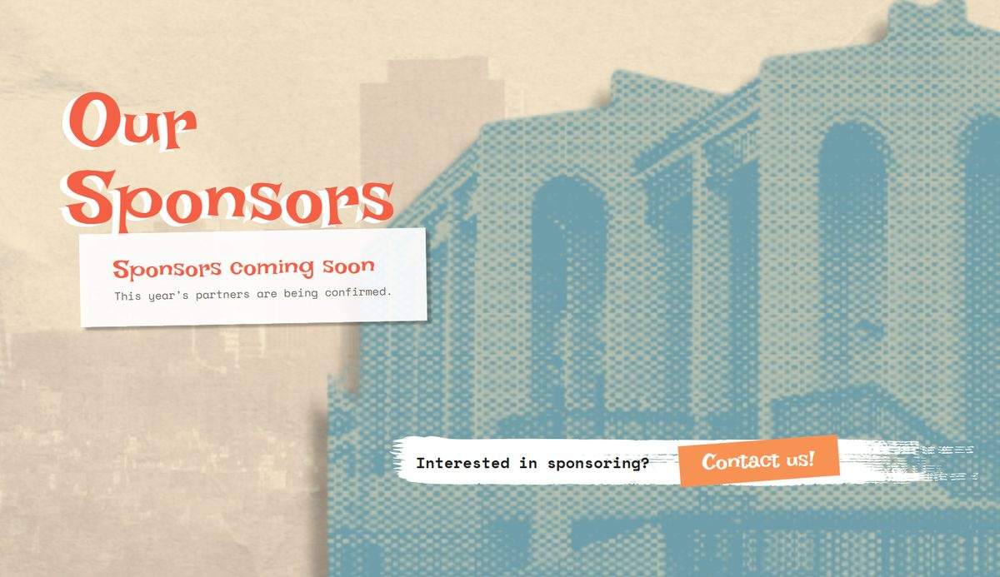
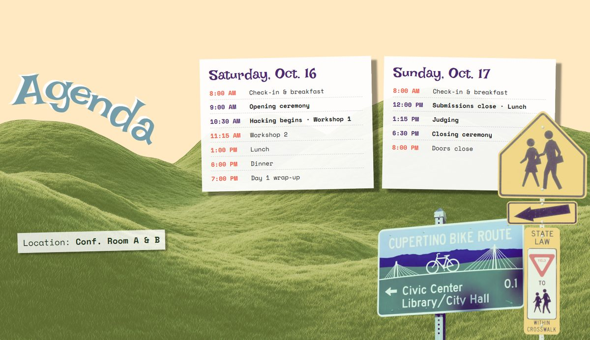
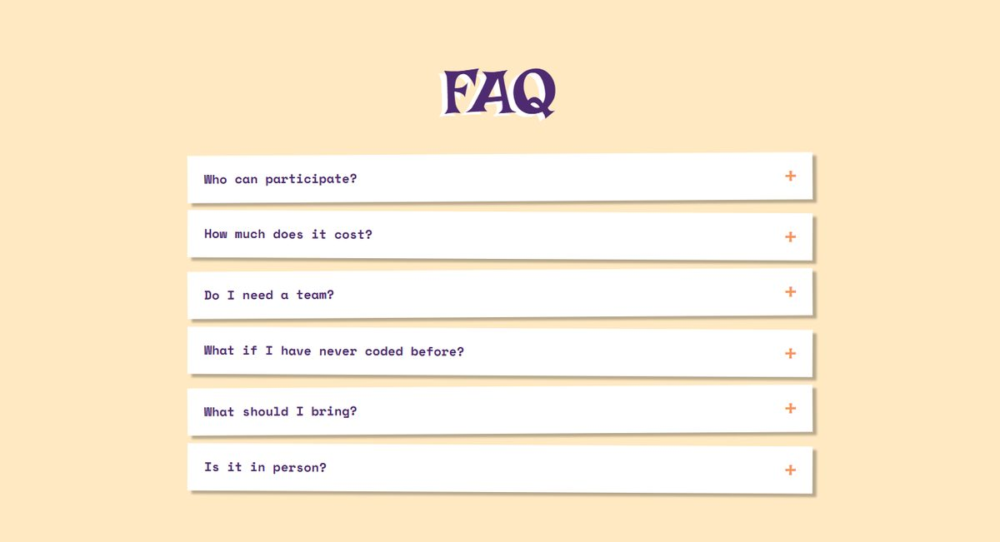

<h1 align="center">De Anza Hacks 5.0</h1>

<p align="center">
  <strong>The website for De Anza Hacks 5.0</strong>, Cupertino's student hackathon<br>
  October 16–17, 2026 · De Anza College
</p>

<p align="center">
  <a href="https://deanzahacks.com"></a>
  <a href="https://github.com/da-hacks/da-hacks-5.0-website"></a>
  
  
</p>

<p align="center">
  
</p>

> [!NOTE]
> This is the **original build** of the De Anza Hacks 5.0 website, made from the De Anza Hacks Figma file. The site is now maintained by the DA Hacks team in **[da-hacks/da-hacks-5.0-website](https://github.com/da-hacks/da-hacks-5.0-website)** (team access only) and is live at **[deanzahacks.com](https://deanzahacks.com)**.

## Contents

- [About](#about)
- [Features](#features)
- [Screenshots](#screenshots)
- [Getting started](#getting-started)
- [Project structure](#project-structure)
- [Editing content](#editing-content)
- [Design](#design)
- [Implementation notes](#implementation-notes)
- [Official site and repository](#official-site-and-repository)
- [Credits](#credits)
- [License](#license)

## About

De Anza Hacks is an annual weekend-long hackathon at De Anza College, where students from every background come together to turn big ideas into working tech projects. This repository is the marketing site for the 5.0 edition: a hand-made paper-collage design, with torn paper, halftone cut-outs and the Golden Gate Bridge, brought to life with stop-motion-style animation.

## Features

- **Faithful to the Figma design.** Each section is an aspect-locked stage, so every collage layer uses the design's own positions and the whole composition scales as one piece.
- **Cut-paper motion.** A single `Reveal` component lays each piece onto the page like paper: offset, slightly off-angle, overshooting, then settling. It respects `prefers-reduced-motion`.
- **Scroll-driven scenes.** On desktop, the hero smart-animates into About and then Sponsors as you scroll, like a Figma prototype driven by the scroll wheel.
- **Three designed layouts.** The page picks the Figma file's laptop, iPad, or iPhone composition by screen shape and scales it to fit, so phones and tablets get layouts designed for them rather than a squeezed desktop.
- **Lightweight stack.** React 19 and plain CSS, with no UI framework and one shared `IntersectionObserver` for all animations.
- **Content in one place.** The apply link and contact email live in `src/config.js`; the schedule and FAQ are plain data files.

## Screenshots

| About | Sponsors |
| --- | --- |
|  |  |
| **Agenda** | **FAQ** |
|  |  |

## Getting started

### Prerequisites

- [Node.js](https://nodejs.org) 20.19+ or 22.12+
- npm

### Install and run

```bash
git clone https://github.com/tthy-working/da-hacks.git
cd da-hacks
npm install
npm run dev
```

Then open [http://localhost:5173](http://localhost:5173).

| Command | What it does |
| --- | --- |
| `npm run dev` | Starts the dev server with hot reload |
| `npm run build` | Builds the production site into `dist/` |
| `npm run preview` | Serves the production build locally |

## Project structure

```
da-hacks/
├── index.html
├── public/assets/          Images exported from the Figma file
├── docs/                   README images and implementation notes
└── src/
    ├── App.jsx             Page layout
    ├── config.js           Apply link and contact email
    ├── breakpoints.js      Picks the phone, tablet, or laptop frame
    ├── components/
    │   ├── NavBar.jsx      Fixed nav; collapses to a menu on small screens
    │   ├── Hero.jsx        Figma screen 1
    │   ├── About.jsx       Figma screen 2
    │   ├── Sponsors.jsx    Figma screen 3
    │   ├── Agenda.jsx      Figma screen 4
    │   ├── Faq.jsx         FAQ accordion
    │   ├── Apply.jsx       Closing call to action
    │   ├── Scene.jsx       Scroll-driven move from the hero into About and Sponsors
    │   └── Reveal.jsx      Scroll-reveal animation primitive
    ├── data/
    │   ├── agenda.js       Event schedule
    │   └── faq.js          FAQ questions and answers
    └── styles/             One stylesheet per section, plus base.css and reveal.css
```

## Editing content

| To change | Edit |
| --- | --- |
| Where the "Apply now!" buttons go | `APPLY_URL` in [`src/config.js`](src/config.js) |
| The sponsorship contact email | `CONTACT_EMAIL` in [`src/config.js`](src/config.js) |
| The schedule | [`src/data/agenda.js`](src/data/agenda.js) |
| FAQ questions and answers | [`src/data/faq.js`](src/data/faq.js) |

> [!IMPORTANT]
> In this repository the FAQ answers, sponsor logos, and contact email are still placeholders. The latest event details live in the [official repo](https://github.com/da-hacks/da-hacks-5.0-website) and on [deanzahacks.com](https://deanzahacks.com).

## Design

Built from the [De Anza Hacks Figma file](https://www.figma.com/design/m06i6VAe8Q2vMknIxLvqUc/De-Anza-Hacks).

| | Color | Hex |
| --- | --- | --- |
|  | Purple | `#4E2A70` |
|  | Cream | `#FFE9C2` |
|  | Slate | `#759DA9` |
|  | Orange | `#F89254` |
|  | Coral | `#F46045` |
|  | Olive | `#8EA345` |
|  | Ink | `#1E1E1E` |

| Typeface | Used for |
| --- | --- |
| [Irish Grover](https://fonts.google.com/specimen/Irish+Grover) | Headings and buttons |
| [Space Mono](https://fonts.google.com/specimen/Space+Mono) | Body text |

All tokens are CSS custom properties at the top of [`src/styles/base.css`](src/styles/base.css).

## Implementation notes

Detailed engineering notes are in [`docs/implementation-notes.md`](docs/implementation-notes.md):

- **Motion:** how `Reveal` works, its tuning knobs, and why the observer threshold must stay at `0`
- **Responsive:** how the phone, tablet, and laptop frames are chosen and scaled
- **Scroll scene:** how the hero morphs into About and Sponsors on desktop
- **Deviations from Figma:** fixed typos, rebuilt text, and the unusual tree layer that must not be "simplified"
- **Known issues:** asset sizes to optimize and fonts to self-host before launch

## Official site and repository

| | |
| --- | --- |
| Live site | [deanzahacks.com](https://deanzahacks.com) |
| Official repository | [da-hacks/da-hacks-5.0-website](https://github.com/da-hacks/da-hacks-5.0-website) (DA Hacks team access) |
| Organizer | [DA Hacks on GitHub](https://github.com/da-hacks) |

The official repository continues from this build and holds the latest updates, such as the confirmed schedule and event location.

## Credits

- **Website build:** [@tthy-working](https://github.com/tthy-working)
- **Event and design:** [De Anza Hacks](https://deanzahacks.com) ([@da-hacks](https://github.com/da-hacks))

## License

This repository doesn't include an open-source license. The De Anza Hacks name, artwork, and branding belong to De Anza Hacks.
